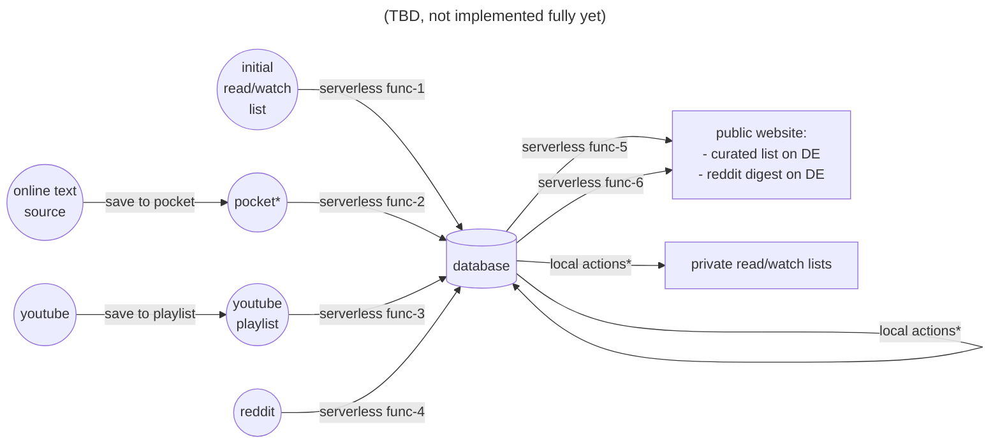
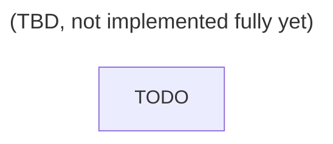

### what is it?

Library helping organize personal micro data warehouse.

It is main purpose is to structure data flows.


### disclaimer

This library is under active development, any interface may change without notice.

It is part of another [private project](https://github.com/smirnovkirilll/lookmomimadataengineer), provided "as is" and is unlikely to be changed upon request.

The main reason it is published is to host it in a highly available environment.

> [!WARNING]
> Overall: there is no point in using it for anyone, unless you want to recreate my home DWH


### installation

```shell
pip install git+https://github.com/smirnovkirilll/micro_dwh.git
```


### Data flow map (source aspect)



notes:
- local actions - all the kinds of actions useful to make tables more consistent, add the necessary tags, read marks, material quality marks, comments, deduplication, etc.
- reddit digest - not published yet, does not involve any human control, should work completely autonomously, scripts are stored here in the same repo and hosted in the cloud
- pocket is dead now, some alternative to be used


### Data flow map (layer aspect)


